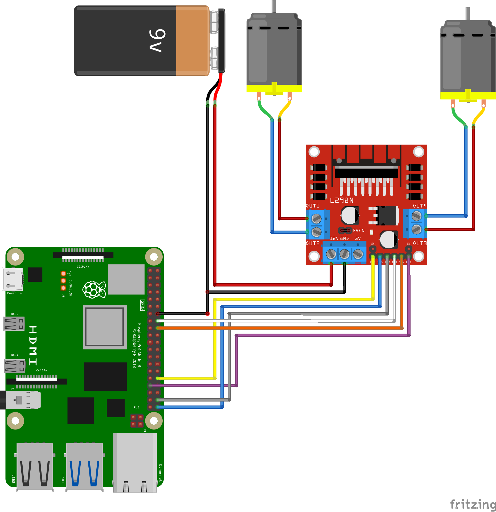

# l298n

L298N Motor Driver Ros Package

This Package is for RaspberryPi

### Yotube Video

https://youtu.be/YasgEIyAXLs

### Diagram



### Dependency package
- [wiringPi](http://wiringpi.com/download-and-install/)

- [motor_driver_msgs](https://github.com/PigeonSensei/pigeon_motor_driver/tree/master/motor_driver_msgs)

### Run

```bash
roslaunch l298n l298n.launch
```

### Subscribed Topics

- motor_command ([motor_driver_msgs/MotorCommand](https://github.com/PigeonSensei/pigeon_motor_driver/blob/master/motor_driver_msgs/msg/MotorCommand.msg))

### Services
- SetMotorDriver ([l298n/SetMotorDriver](https://github.com/PigeonSensei/pigeon_motor_driver/blob/master/l298n/srv/SetMotorDriver.srv))

  -  command

     EMStop : E-stop mode on motor driver
     
     EMStopRelease : E-stop mode release on motor driver

### Parameters

- ~ IN1 (int, default: -1)

  Gpio Pin number corresponding to IN1 of motor driver
  
- ~ IN2 (int, default: -1)

  Gpio Pin number corresponding to IN2 of motor driver  

- ~ IN3 (int, default: -1)

  Gpio Pin number corresponding to IN3 of motor driver

- ~ IN4 (int, default: -1)

  Gpio Pin number corresponding to IN4 of motor driver

- ~ ENA (int, default: -1)

  Gpio Pin number corresponding to ENA of motor driver

- ~ ENB (int, default: -1)

  Gpio Pin number corresponding to ENB of motor driver
  
- ~ minimum_motor_command (int, default: 20)

  minimum value of motor_command
  
- ~ maximum_motor_command (int, default: 300)

  maximum value of motor_command

